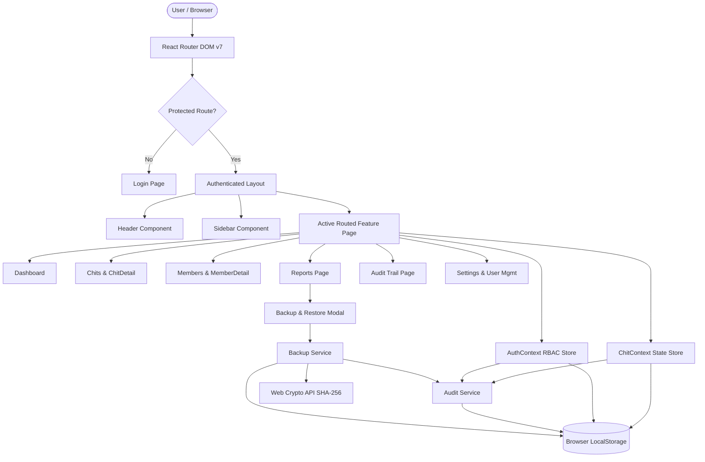
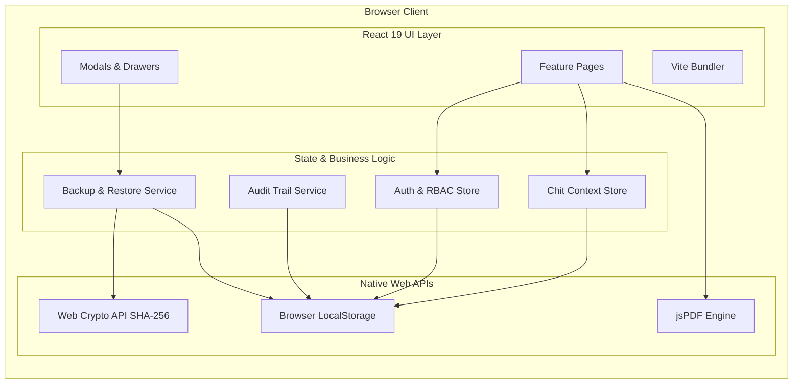
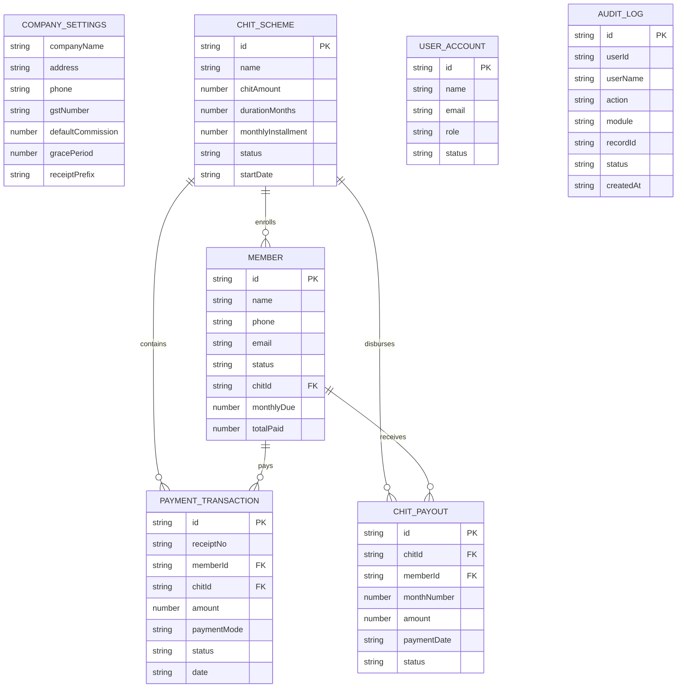

# Chit Fund Management System — Complete Technical Documentation

> **Document Type:** Single Source of Truth Technical Reference  
> **Target Audience:** Future Software Engineers, System Architects, Compliance Auditors, and AI Coding Agents  
> **Last Verified Against Source Code:** September 2026  
> **Application Version:** 2.4.0  

---

## 1. Project Overview

The **Chit Fund Management System** is an enterprise-grade financial management web application designed for chit fund organizers, branch managers, and collection agents. It handles the complete operational lifecycle of chit schemes, including scheme configurations (Daily, Weekly, Monthly, Step-Up), auction scheduling, dividend calculations, slot member enrollments, payment and collection tracking, official receipt generation with PDF export, role-based access control, an immutable **Audit Trail**, and a complete cryptographic **Backup & Restore System**.

The application is structured as a client-side Single Page Application (SPA) powered by **React 19**, **TypeScript**, and **Vite**, with high-performance browser-local persistence and reactive cross-tab event synchronization.

---

## 2. Complete Technology Stack

| Category | Technology | Version | Purpose | Where Used |
| :--- | :--- | :--- | :--- | :--- |
| **Frontend Framework** | React | `^19.2.8` | Declarative UI component library | Entire user interface across all features |
| **Frontend DOM** | React DOM | `^19.2.8` | React rendering engine for web browsers | `src/main.tsx` entry point |
| **Language** | TypeScript | `~6.0.2` | Static typing, interface definitions, compile-time validation | Entire codebase (`.ts`, `.tsx`) |
| **Build & Dev Tool** | Vite | `^8.2.2` | Ultra-fast development server, HMR, and Rollup production bundler | Root build pipeline, `vite.config.ts` |
| **Routing** | React Router DOM | `^7.18.3` | Client-side routing, route protection, redirects | `src/App.tsx`, layout components |
| **CSS Engine** | Tailwind CSS | `^4.3.3` | Utility-first CSS framework with Vite integration | `src/index.css`, components |
| **Tailwind Vite Plugin**| `@tailwindcss/vite` | `^4.3.3` | First-party Vite compiler plugin for Tailwind v4 | `vite.config.ts` |
| **CSS Post-processor** | PostCSS & Autoprefixer| `^8.5.28` / `^10.5.4` | CSS transformation and vendor prefixing | CSS build chain |
| **Iconography** | Lucide React | `^1.41.0` | Modern SVG iconography | Navigation, cards, tables, action buttons |
| **Class Utilities** | `clsx` & `tailwind-merge` | `^2.1.1` / `^3.6.0` | Dynamic conditional class merging without specificity bugs | Shared UI components |
| **PDF Generation** | jsPDF | `^4.2.1` | Client-side vector PDF document creation | Receipt generation, report exports, audit exports |
| **PDF Tables** | jsPDF-AutoTable | `^5.0.8` | Tabular data formatting and pagination inside PDF documents | Reports PDF export, audit log PDF export |
| **State Management** | React Context API | Native | Centralized reactive in-memory state with hooks | `ChitContext.tsx`, `AuthContext.tsx` |
| **Persistence / DB** | LocalStorage API | Native Web API | Client-side persistent key-value document store | `src/shared/utils/storage.ts`, services |
| **Integrity / Crypto** | Web Crypto API | Native (`crypto.subtle`)| SHA-256 cryptographic hashing for backup integrity | `src/shared/services/backupService.ts` |
| **Linter** | Oxlint | `^1.79.0` | Ultra-fast JavaScript/TypeScript linter | Code quality checking (`npm run lint`) |
| **Backend** | *Not implemented.* | N/A | No dedicated server process (Node/Express/NestJS/Django) exists. Persistence is local client-side. | N/A |
| **Database Server** | *Not implemented.* | N/A | No SQL (PostgreSQL, MySQL) or NoSQL (MongoDB) server. LocalStorage JSON used. | N/A |
| **REST API Server** | *Not implemented.* | N/A | Client-side in-memory services act as the data provider layer. | N/A |
| **Hosting Platform** | Apache / LiteSpeed / Hostinger | Custom `.htaccess` | Static asset hosting, security headers, SPA rewrite rules | `public/.htaccess`, `dist/` |

---

## 3. Exact Versions of All Major Technologies

- **React**: `19.2.8`
- **React DOM**: `19.2.8`
- **React Router DOM**: `7.18.3`
- **TypeScript**: `6.0.2`
- **Vite**: `8.2.2` (Runtime report `v8.3.0`)
- **Tailwind CSS**: `4.3.3`
- **jsPDF**: `4.2.1`
- **jsPDF-AutoTable**: `5.0.8`
- **Lucide React**: `1.41.0`
- **Node.js Compatibility**: Node `18.x`, `20.x`, `22.x`, `24.x` (Tested and verified on Node `v24.14.0`)

---

## 4. Complete package.json Dependency List with Purpose

```json
{
  "dependencies": {
    "clsx": "^2.1.1",
    "jspdf": "^4.2.1",
    "jspdf-autotable": "^5.0.8",
    "lucide-react": "^1.41.0",
    "react": "^19.2.8",
    "react-dom": "^19.2.8",
    "react-router-dom": "^7.18.3",
    "tailwind-merge": "^3.6.0"
  },
  "devDependencies": {
    "@tailwindcss/vite": "^4.3.3",
    "@types/node": "^24.13.3",
    "@types/react": "^19.2.18",
    "@types/react-dom": "^19.2.4",
    "@vitejs/plugin-react": "^6.1.0",
    "autoprefixer": "^10.5.4",
    "oxlint": "^1.79.0",
    "postcss": "^8.5.28",
    "tailwindcss": "^4.3.3",
    "typescript": "~6.0.2",
    "vite": "^8.2.2"
  }
}
```

### Dependency Purpose Breakdown:
1. **`clsx`**: Utility for constructing conditional `className` strings with boolean and object expressions.
2. **`jspdf`**: Comprehensive client-side PDF document compiler used for downloading receipts and reports.
3. **`jspdf-autotable`**: Plugin for jsPDF that creates responsive, formatted tables with headers, borders, and page breaks.
4. **`lucide-react`**: Tree-shakeable SVG icon collection matching the application's clean, modern visual design.
5. **`react` & `react-dom`**: Core React library for virtual DOM reconciliation and component lifecycle management.
6. **`react-router-dom`**: Declarative routing engine enabling client-side navigation, history management, and route protection.
7. **`tailwind-merge`**: Intelligently merges Tailwind CSS classes without style conflicts or ordering issues.
8. **`@tailwindcss/vite`**: Vite plugin compiling Tailwind v4 directly inside the Vite build lifecycle.
9. **`@vitejs/plugin-react`**: Provides Fast Refresh (HMR) and JSX compilation via Babel.
10. **`oxlint`**: High-speed Rust-based linter for static syntax and security checks.
11. **`typescript`**: Compiler providing strict static types and compile-time verification.

---

## 5. Project Folder/File Structure

```
c:\Users\SMS STUDIO\Desktop\Chit Fund\
├── public/
│   ├── .htaccess                      # Production Apache/Hostinger security & SPA routing rules
│   ├── icon.ico                       # Application favicon (ICO format)
│   └── icon.png                       # Application brand icon (PNG format)
├── src/
│   ├── features/                      # Domain-driven feature modules
│   │   ├── audit/                     # Dedicated Audit Trail feature
│   │   │   ├── components/            # AuditFilterBar, AuditStatsCards, AuditDetailModal
│   │   │   ├── pages/                 # AuditTrail.tsx
│   │   │   └── index.ts               # Feature public barrel exports
│   │   ├── auth/                      # Authentication & RBAC feature
│   │   │   ├── components/            # ProtectedRoute.tsx
│   │   │   ├── context/               # AuthContext.tsx
│   │   │   ├── pages/                 # Login.tsx
│   │   │   ├── permissions.ts         # Permission constants & role matrices
│   │   │   └── index.ts               # Feature public barrel exports
│   │   ├── chits/                     # Chit Schemes & Auctions feature
│   │   │   ├── components/            # SearchableMemberSelect.tsx
│   │   │   ├── pages/                 # Chits.tsx, ChitDetail.tsx
│   │   │   └── index.ts               # Feature public barrel exports
│   │   ├── dashboard/                 # Overview metrics & KPI analytics
│   │   │   ├── pages/                 # Dashboard.tsx
│   │   │   └── index.ts               # Feature public barrel exports
│   │   ├── members/                   # Member Directory & Profile management
│   │   │   ├── pages/                 # Members.tsx, MemberDetail.tsx
│   │   │   └── index.ts               # Feature public barrel exports
│   │   ├── reports/                   # Financial Reports & Backup trigger
│   │   │   ├── components/            # BackupRestoreModal.tsx
│   │   │   ├── pages/                 # Reports.tsx
│   │   │   ├── utils/                 # exportUtils.ts (CSV & PDF export helpers)
│   │   │   └── index.ts               # Feature public barrel exports
│   │   └── settings/                  # Company settings, chit rules, user management
│   │       ├── components/            # UserManagementTable.tsx
│   │       ├── pages/                 # Settings.tsx
│   │       └── index.ts               # Feature public barrel exports
│   ├── shared/                        # Cross-cutting application utilities & components
│   │   ├── components/
│   │   │   ├── layout/                # Header.tsx, Sidebar.tsx
│   │   │   └── ui/                    # ErrorBoundary, Modal, ReceiptModal, StatCard, StatusBadge, ToastContainer
│   │   ├── context/                   # ChitContext.tsx (Central business state)
│   │   ├── services/                  # auditService.ts, backupService.ts
│   │   └── utils/                     # dateUtils.ts, storage.ts
│   ├── types/
│   │   └── index.ts                   # Universal TypeScript interfaces and data models
│   ├── App.tsx                        # Root routing declarations and layout integration
│   ├── index.css                      # Global design tokens, scrollbars, and animations
│   └── main.tsx                       # React DOM root bootstrapping
├── index.html                         # HTML template with Google Fonts and viewport metadata
├── package.json                       # Dependencies, metadata, and npm scripts
├── package-lock.json                  # Resolved dependency tree lockfile
├── tsconfig.json                      # Root TypeScript solution configuration
├── tsconfig.app.json                  # Application TypeScript compiler options and path aliases
├── tsconfig.node.json                 # Node toolchain TypeScript configuration
├── vite.config.ts                     # Vite build, aliases, and rollup chunk optimization
├── README.md                          # General overview and operational guide
├── BACKUP_AND_AUDIT_MANUAL.md         # Dedicated operator manual for Backup and Audit Trail
└── PROJECT_TECHNICAL_DOCUMENTATION.md # Complete technical specification (this document)
```

---

## 6. Application Architecture



---

## 7. Frontend Architecture

The frontend follows a **Feature-Based Modular Architecture**:
1. **Presentation Layer (`src/features/*/pages`)**: Self-contained route targets containing UI layouts, tables, and search controls.
2. **Context Layer (`src/shared/context`, `src/features/auth/context`)**: React Context providers managing in-memory state and publishing state changes.
3. **Service Layer (`src/shared/services`)**: Pure TypeScript utilities handling complex domain logic (Audit logging, Backup packaging, Cryptographic verification).
4. **Storage Adapter (`src/shared/utils/storage.ts`)**: Encapsulates LocalStorage access, versioning, JSON serialization, and quota alerts.
5. **Cross-Tab Synchronizer**: Listens for native `StorageEvent` and custom window events (`chitfund_app_data_updated`, `chitfund_audit_updated`) to sync modifications across open browser tabs without manual reloads.

---

## 8. Backend Architecture

- **Server-Side Process**: *Not implemented.*  
- **API Framework (e.g., Express, NestJS, Django, FastAPI)**: *Not implemented.*  
- **Remote Database Server**: *Not implemented.*  
- **Current Architectural Implementation**: The system operates as a standalone, zero-latency client-side application. The business logic, calculation engines, and persistence layers run directly inside the user's browser environment. Data is persisted in the browser's persistent storage.

---

## 9. Database Architecture

- **Database Engine**: Browser LocalStorage Key-Value Document Store.
- **Storage Strategy**: Structured JSON documents partitioned by domain keys.
- **Primary Storage Keys**:
  - `chitfund_app_data`: Stores core operational data (Schemes, Members, Transactions, Payouts, Settings).
  - `chitfund_users`: Stores user accounts, assigned roles, and permissions.
  - `chitfund_auth`: Stores current active session (User ID, Name, Email, Role).
  - `chitfund_audit_logs`: Stores append-only audit trail records.
  - `chitfund_backup_history`: Stores backup snapshot history.
  - `chitfund_role_defaults`: Stores role permission template overrides.

---

## 10. Database Tables/Entities and Relationships

### 1. `CompanySettings`
- **Fields**: `companyName` (string), `name` (string), `logoText` (string), `address` (string), `phone` (string), `email` (string), `gstNumber` (string), `defaultCommission` (number), `gracePeriod` (number), `paymentModes` (string[]), `receiptPrefix` (string), `receiptHeader` (string), `receiptFooter` (string), `signatureText` (string), `logo` (string).
- **Primary Key**: Implicit singleton.
- **Relationships**: Parent configuration for receipt numbers and default penalty policies.

### 2. `ChitScheme`
- **Fields**: `id` (PK string, e.g., `CHIT-0008`), `name` (string), `chitAmount` (number), `memberCount` / `membersCount` (number), `durationMonths` (number), `monthlyInstallment` (number), `baseMonthlyAmount` (number), `initialBidAmount` (number), `bidReductionMethod` (`'Auto' | 'Fixed' | 'Percentage'`), `bidReductionValue` (number), `collectedAmount` (number), `pendingAmount` (number), `startDate` (ISO string), `endDate` (string), `commissionPercentage` (number), `gracePeriodDays` (number), `status` (`'Active' | 'Upcoming' | 'Completed' | 'Draft'`), `description` (string), `installmentType` (`'Daily' | 'Weekly' | 'Monthly' | 'Fixed' | 'StepUp'`), `monthlyIncreaseAmount` (number), `enrolledMemberIds` (string[] FK), `monthStatuses` (Record<number, MonthStatus>), `monthMemberAssignments` (Record<number, string[] | string>), `monthOverrides` (Record<number, MonthCustomDetails>), `monthPayouts` (Record<number, ChitPayout>).
- **Relationships**: 1-to-Many with `Member` (via `enrolledMemberIds`), 1-to-Many with `MonthlyScheduleItem`, 1-to-Many with `PaymentTransaction`, 1-to-Many with `ChitPayout`.

### 3. `Member`
- **Fields**: `id` (PK string, e.g., `CH001`, `MEM-00125`), `name` (string), `phone` (string), `email` (string), `address` (string), `status` (`'Active' | 'Inactive' | 'Pending'`), `createdAt` (ISO string), `joinedDate` (string), `chitId` (string FK), `chitName` (string), `monthlyDue` (number), `totalPaid` (number), `pendingAmount` (number), `paymentStatus` (`'Paid' | 'Pending' | 'Partial' | 'Overdue' | 'none'`), `isAssigned` (boolean), `enrolledChitIds` (string[] FK), `notes` (string), `slotNumber` (number).
- **Relationships**: Many-to-Many with `ChitScheme` (via `enrolledChitIds`), 1-to-Many with `PaymentTransaction`.

### 4. `PaymentTransaction`
- **Fields**: `id` (PK string, e.g., `TXN-17263000-101`), `receiptNo` (string, unique business key), `chitId` (string FK), `chitName` (string), `memberId` (string FK), `payerMemberId` (string FK), `memberName` (string), `memberPhone` (string), `monthNumber` (number), `monthId` (string), `amount` (number), `paidAmount` (number), `dueAmount` (number), `monthlyDue` (number), `previousPending` (number), `currentDue` (number), `remainingBalance` (number), `date` / `paymentDate` (string), `paymentMode` (PaymentMode string), `status` (`'Paid' | 'Pending' | 'Partial'`), `paidTo` (string), `paidToType` (`'ORGANIZER' | 'WINNER'`), `receiverId` (string), `receiverName` (string), `collectedBy` (string), `referenceNo` / `referenceId` (string), `receiptUrl` (string Base64), `notes` (string), `type` (`'Collection' | 'Payout'`), `createdAt` (ISO string).
- **Foreign Keys**: `memberId` → `Member.id`, `chitId` → `ChitScheme.id`.

### 5. `ChitPayout`
- **Fields**: `id` (PK string, e.g., `POUT-17263000-202`), `chitId` (string FK), `monthId` (string), `monthNumber` (number), `memberId` (string FK), `memberName` (string), `memberPhone` (string), `amount` (number), `paymentDate` (string), `paymentMode` (string), `status` (`'Paid' | 'Pending'`), `referenceNo` (string), `notes` (string), `type` (`'Payout'`), `createdAt` (ISO string).
- **Foreign Keys**: `chitId` → `ChitScheme.id`, `memberId` → `Member.id`.

### 6. `UserAccount`
- **Fields**: `id` (PK string, e.g., `USR-SUPERADMIN`), `name` (string), `email` (string), `password` (string - excluded from backups), `role` (`'Super Admin' | 'Admin / Manager' | 'Staff' | 'Custom Role'`), `customRoleName` (string), `status` (`'Active' | 'Disabled'`), `permissions` (string[]), `createdAt` (string), `createdBy` (string), `updatedAt` (string).

### 7. `AuditLogEntry`
- **Fields**: `id` (PK string, e.g., `AUD-17263000-001`), `userId` (string), `userName` (string), `userRole` (string), `action` (AuditAction string), `module` (AuditModule string), `recordId` (string), `recordName` (string), `description` (string), `beforeData` (object / null), `afterData` (object / null), `changedFields` (AuditFieldChange[]), `ipAddress` (string), `userAgent` (string), `status` (`'Success' | 'Failed'`), `failureReason` (string), `metadata` (object), `createdAt` (ISO string).

### 8. `BackupPackage` & `BackupHistoryItem`
- **Fields**: `metadata` (BackupMetadata), `checksum` (SHA-256 string), `data` (appData, users, roleDefaults, auditLogs).

---

## 11. All Application Modules

1. **Authentication & Session (`/login`)**
2. **Dashboard Overview (`/dashboard`)**
3. **Chit Schemes & Auctions (`/chits`, `/chits/:id`)**
4. **Member Directory & Ledger (`/members`, `/members/:id`)**
5. **Installment Payments & Receipts (`/payments`, `/collections`)**
6. **Financial Reports (`/reports`)**
7. **Audit Trail (`/audit-trail`)**
8. **System Backup & Restore (`/reports` modal)**
9. **Admin Settings & User Management (`/settings`)**

---

## 12. All Routes / Pages

| Route | Page Component | Authentication Required | Required Permission | Purpose |
| :--- | :--- | :---: | :---: | :--- |
| `/login` | `Login` | No | None (Public) | Authenticate user via username/email and password |
| `/` | `RootRedirect` | Yes | Authenticated Session | Resolves home landing page based on user permissions |
| `/dashboard` | `Dashboard` | Yes | `dashboard.view` | Overall business metrics, stats, upcoming dues |
| `/chits` | `Chits` | Yes | `chits.view` | Chit scheme directory, scheme creation modal |
| `/chits/:id` | `ChitDetail` | Yes | `chits.view` | Scheme schedules, auctions, payouts, assignments |
| `/members` | `Members` | Yes | `members.view` | Member directory, member registration modal |
| `/members/:id` | `MemberDetail` | Yes | `members.view` | Member profile, enrollment list, payment ledger |
| `/payments` | `PaymentsRedirect` | Yes | `payments.view` | Smart redirect to active payment collection view |
| `/collections` | `PaymentsRedirect` | Yes | `payments.view` | Smart redirect to active payment collection view |
| `/reports` | `Reports` | Yes | `reports.view` | 7 financial collection reports + Backup button |
| `/audit-trail` | `AuditTrail` | Yes | `audit_trail.view` | Standalone security log and activity audit trail |
| `/settings` | `Settings` | Yes | `settings.view` | Company profile, chit rules, receipt format, RBAC |
| `*` | `RootRedirect` | Yes | Authenticated Session | Catch-all redirect preventing 404 dead-ends |

---

## 13. API Endpoints / Services

Because the application runs client-side, traditional HTTP REST endpoints are **Not implemented**. Instead, domain services fulfill data operations:

### 1. Storage API (`src/shared/utils/storage.ts`)
- `getAppData()`: Retrieves and deserializes `chitfund_app_data`.
- `saveAppData(data: AppData)`: Serializes and stores data with quota protection.
- `updateAppData(updater)`: Atomic functional state updater.

### 2. Audit Service (`src/shared/services/auditService.ts`)
- `getAuditLogs()`: Fetches audit trail records, populating seeds if empty.
- `logActivity(params)`: Sanitizes data, redacts secrets, calculates diffs, prepends entry.
- `exportAuditLogsToCSV(logs)`: Generates Excel-compatible CSV download.
- `exportAuditLogsToPDF(logs, companyName)`: Generates landscape formatted PDF report.

### 3. Backup Service (`src/shared/services/backupService.ts`)
- `createSystemBackup(user, onProgress, isSafetyBackup)`: Assembles full snapshot, hashes with SHA-256, generates `.chitbackup`.
- `validateBackupFile(fileContent)`: Checks JSON syntax, app name, schema, and validates checksum.
- `createPreRestoreSafetyBackup(user)`: Automatic safety snapshot prior to restoration.
- `restoreSystemBackup(pkg, user)`: Restores application tables, preserves Super Admin credentials, logs `RESTORE_STARTED` and `RESTORE_COMPLETED`.

---

## 14. Authentication Flow

1. **Credentials Input**: User submits username or email and password at `/login`.
2. **Account Lookup**: `login()` in `AuthContext.tsx` searches `chitfund_users`.
3. **Status Check**: Verifies if account status is `Active` or `Disabled`. If `Disabled`, rejects with `"Your account is disabled. Please contact the Super Admin."` and logs `LOGIN_FAILED`.
4. **Password Verification**: Validates password. On failure, logs `LOGIN_FAILED` in Audit Trail with failure reason `"Invalid Password"`.
5. **Session Creation**: On success, records session in `localStorage.setItem('chitfund_auth', ...)` and logs `LOGIN_SUCCESS`.
6. **Redirection**: Redirects user to `/dashboard` or first permitted module.
7. **Session Termination**: `logout()` clears `chitfund_auth`, logs `LOGOUT`, and routes to `/login`.

---

## 15. User Roles and Permissions

### User Roles:
1. **Super Admin**: Supreme administrator with all privileges (`ALL_PERMISSIONS`).
2. **Admin / Manager**: Operations manager with scheme, member, payment, report, and backup creation permissions.
3. **Staff**: Collection agent with member view, payment creation, and report view permissions.
4. **Custom Role**: Customizable privilege set configured per organization requirements.

---

## 16. RBAC Implementation

RBAC is enforced via:
- **`ProtectedRoute` component**: Inspects `isAuthenticated` and verifies `hasPermission(requiredPermission)`. Renders `Access Restricted` message or redirects to `/login`.
- **UI Element Conditional Rendering**: Action buttons, edit modals, and delete buttons verify `hasPermission()` or `isSuperAdmin()`.
- **Sidebar Filtering**: Nav items are filtered according to the active user's permissions.
- **Route Level Enforcements**: Direct URL entry (e.g. `/audit-trail`, `/settings`) is blocked at the route router level.

---

## 17. Chit Fund Business Logic

### Core Calculations (`src/shared/context/ChitContext.tsx`):
1. **Base Monthly Installment**:
   $$\text{Base Monthly} = \frac{\text{Chit Total Amount}}{\text{Member Count}}$$
2. **Foreman Commission**:
   $$\text{Commission} = \text{Chit Total Amount} \times \left(\frac{\text{Commission Percentage}}{100}\right)$$
3. **Auction Bid Reduction**:
   - **Auto Mode**: Bidding reduction step calculated as $\frac{\text{Initial Bid}}{\text{Duration} - 2}$.
   - **Fixed Mode**: Constant reduction amount.
   - **Percentage Mode**: Compound reduction percentage per month.
4. **Dividend per Member**:
   $$\text{Dividend} = \frac{\text{Bid Amount} - \text{Commission}}{\text{Member Count}}$$
5. **Net Installment Payable**:
   $$\text{Net Payable} = \text{Base Installment} - \text{Dividend}$$
6. **Prize Amount Disbursed to Winner**:
   $$\text{Prize Amount} = \text{Chit Total Amount} - \text{Winning Bid Amount} - (\text{Month 1 Commission})$$

---

## 18. Members Module

- **Purpose**: Manage participant profiles, contact information, and chit enrollments.
- **Components**: `Members.tsx`, `MemberDetail.tsx`.
- **Data Entities**: `Member`, `PaymentTransaction`, `ChitScheme`.
- **CRUD Operations**:
  - **Create**: Register member with name, phone, email, address, and initial scheme.
  - **Read**: Search, filter by active/inactive status, view individual payment ledger.
  - **Update**: Edit member contact info, change scheme assignment.
  - **Delete**: Soft-delete / deactivate if financial records exist (preserving audit integrity); hard-delete if no transactions exist.
- **Permissions**: `members.view`, `members.create`, `members.edit`, `members.delete`.

---

## 19. Chits Module

- **Purpose**: Create and manage chit schemes, auction cycles, and payout disbursements.
- **Components**: `Chits.tsx`, `ChitDetail.tsx`, `SearchableMemberSelect.tsx`.
- **Data Entities**: `ChitScheme`, `MonthlyScheduleItem`, `Auction`, `ChitSlot`, `ChitPayout`.
- **CRUD Operations**:
  - **Create**: Configure scheme value, member slots, duration, commission, installment type.
  - **Read**: Scheme cards, progress bars, monthly schedule breakdown, auction winners.
  - **Update**: Edit installment overrides, record auctions, assign winning members, update month status (`Pending`, `Partial`, `Paid`).
  - **Delete**: Remove scheme and cascade unenrollments.
- **Permissions**: `chits.view`, `chits.create`, `chits.edit`, `chits.delete`.

---

## 20. Payments Module

- **Purpose**: Record member installment collections and track outstanding balances.
- **Components**: Payment modals in `ChitDetail.tsx`, `MemberDetail.tsx`, and `ReceiptModal.tsx`.
- **Data Entities**: `PaymentTransaction`.
- **Operations**:
  - Record installment payment (Cash, UPI, Bank Transfer, Cheque).
  - Compute previous pending balance, current due, and remaining balance.
  - Generate unique receipt number using prefix (e.g., `REC-20260914-12345`).
- **Permissions**: `payments.view`, `payments.create`, `payments.edit`, `payments.delete`.

---

## 21. Collections Module

- **Purpose**: Track installment collections across agents and schemes.
- **Routing**: Routes to `PaymentsRedirect` which navigates to scheme/member collection tables.
- **Audit Module**: Tagged under `Collections` in Audit Trail.

---

## 22. Receipts Module

- **Purpose**: Official branded payment receipts with PDF generation and printing.
- **Components**: `ReceiptModal.tsx`.
- **Features**:
  - Company branding (Name, Address, Phone, GST).
  - Member info and installment breakdown.
  - Digital signature text and receipt header/footer notes.
  - Print button (`window.print()`).
  - Download PDF button (`jsPDF` vector rendering).

---

## 23. Expenses Module

- **Implementation Status**: *Not implemented.* (A dedicated standalone Expenses ledger page is not present in the current codebase. Operating expenses are categorized as an `AuditModule` filter and included in backup data structures for future roadmap expansion.)

---

## 24. Reports Module

- **Purpose**: Financial collection and ledger analysis.
- **Page**: `Reports.tsx`.
- **Report Types**:
  1. `Daily Collection`
  2. `Monthly Collection`
  3. `Chit-wise Collection`
  4. `Member Payment Report`
  5. `Pending Report`
  6. `Overdue Report`
  7. `Staff Collection Report`
- **Actions**: Export Excel (CSV), Export PDF (`jsPDF-AutoTable`), Print Report, and Open System **Backup**.
- **Permissions**: `reports.view`, `reports.export`.

---

## 25. Audit Trail Module

- **Purpose**: Independent compliance and activity investigation page (`/audit-trail`).
- **Components**: `AuditTrail.tsx`, `AuditStatsCards.tsx`, `AuditFilterBar.tsx`, `AuditDetailModal.tsx`.
- **Features**:
  - Live activity feed with dynamic KPI cards (Total, Today's, Created, Updated, Deleted).
  - Search, date range filters, module filters, action filters, status filters.
  - Detailed activity inspection modal with **CHANGE DETAILS** before/after diff table.
  - Sensitive data auto-redaction (`[REDACTED]`).
  - Export filtered records to CSV or PDF; Print.
- **Permissions**: `audit_trail.view`, `audit_trail.export`, `audit_trail.print`.

---

## 26. Backup & Restore Module

- **Purpose**: Complete system snapshot creation, integrity verification, and safe restoration.
- **Components**: `BackupRestoreModal.tsx`, `backupService.ts`.
- **Features**:
  - Creates `.chitbackup` archives named `ChitFund_Backup_YYYY-MM-DD_HH-mm-ss.chitbackup`.
  - Computes SHA-256 checksums over serialized data.
  - Automatically captures pre-restore safety backups (`PreRestore_Backup_...`).
  - Strict validation of JSON syntax, checksums, and application compatibility.
  - Interactive restore preview with record counts and risk confirmation checkbox.
  - Strips passwords and secrets from all exports.
  - Preserves Super Admin account credentials during restore.
- **Permissions**: `backup.view`, `backup.create`, `backup.download`, `backup.restore`.

---

## 27. Settings Module

- **Purpose**: System-wide administrative controls (`/settings`).
- **Page**: `Settings.tsx`.
- **Sections**: Company Settings, Chit Rules & Penalties, Receipt Customization, User Management, Role Permissions Matrix.
- **Permissions**: `settings.view`, `settings.edit`, `users.view`, `users.manage_permissions`.

---

## 28. Company Settings

- **Configurable Fields**: Company Name, Business Address, Contact Phone, Support Email, GST Number, Logo Text.
- **Impact**: Controls headers on official receipts, PDF export title blocks, and top sidebar branding.

---

## 29. Chit Rules & Penalties

- **Configurable Fields**: Default Foreman Commission Percentage (e.g., `5%`), Grace Period in Days (e.g., `5 Days`), Default Payment Modes (`Cash`, `UPI`, `Bank Transfer`, `Cheque`).
- **Impact**: Sets auto-fill values when creating new chit schemes.

---

## 30. Receipt Customization

- **Configurable Fields**: Receipt Prefix (e.g., `REC-`), Receipt Header Note, Receipt Footer Note, Authorized Signature Text.
- **Impact**: Directly rendered in `ReceiptModal.tsx` and PDF receipts.

---

## 31. User Management

- **Component**: `UserManagementTable.tsx` (Super Admin restricted).
- **Features**:
  - Create staff and manager user accounts.
  - Edit user names, emails, roles, and statuses (`Active` / `Disabled`).
  - Reset user passwords.
  - Delete user accounts (root Super Admin account cannot be deleted).
  - Customize individual user permission overrides.

---

## 32. Role Permissions Matrix

- **Purpose**: Define default permission policies for system roles (`Super Admin`, `Admin / Manager`, `Staff`, `Custom Role`).
- **Modules Managed**: Dashboard, Chits, Members, Payments, Reports, Settings, Users, Audit Trail, Backup & Restore.
- **Persistence**: Saved in `chitfund_role_defaults`.

---

## 33. Security Architecture

1. **Authentication**: Form-based session authentication with password verification and disabled account checks.
2. **Authorization**: Granular RBAC verified at both the route guard and UI component levels.
3. **Sensitive Data Sanitization**: Passwords, tokens, and secrets are stripped from backups and masked as `[REDACTED]` in audit logs.
4. **Data Tamper Detection**: Backup files utilize SHA-256 cryptographic hashes verified by the browser's Web Crypto API.
5. **Immutable Logs**: Audit entries cannot be edited or deleted through the user interface.
6. **HTTP Production Security**: Comprehensive security headers defined in `public/.htaccess`.

---

## 34. Environment Variables

Supported build and runtime variables (via Vite `import.meta.env`):
- `VITE_ADMIN_EMAIL`: Optional custom default Super Admin login email/username.
- `VITE_ADMIN_PASSWORD`: Optional custom default Super Admin password.

> [!NOTE]
> *No secret backend API keys or database connection strings exist in client-side environment files.*

---

## 35. Build Commands

```bash
# Clean production build (TypeScript type-checking + Vite bundle compilation)
npm run build

# Preview compiled production build locally
npm run preview
```

---

## 36. Development Commands

```bash
# Start local development server with Hot Module Replacement (HMR)
npm run dev

# Run fast Oxlint static analysis
npm run lint
```

---

## 37. Production Deployment Process

1. Execute `npm run build` to generate the compiled static assets in `dist/`.
2. Ensure `dist/.htaccess` (copied from `public/.htaccess`) is included in the deployment bundle.
3. Upload the contents of `dist/` to your web server root (e.g., `public_html/` on Hostinger or cPanel).
4. Verify HTTPS certificate is active.
5. Access the domain and verify SPA client routing and `/audit-trail` directly.

---

## 38. Hostinger Configuration (`.htaccess`)

The application includes an optimized `.htaccess` file configured for Apache/LiteSpeed on Hostinger:
- **Prevent Directory Browsing**: `Options -Indexes`
- **Block Sensitive Files**: Denies direct access to `.env`, `.git`, `package.json`, `.ts`, `.tsx`, `.log`.
- **Security Headers**:
  - `X-Frame-Options: SAMEORIGIN` (Clickjacking prevention)
  - `X-Content-Type-Options: nosniff` (MIME sniffing prevention)
  - `X-XSS-Protection: 1; mode=block`
  - `Referrer-Policy: strict-origin-when-cross-origin`
  - `Permissions-Policy: camera=(), microphone=(), geolocation=(), payment=()`
  - `Strict-Transport-Security: max-age=31536000; includeSubDomains; preload` (HSTS)
  - `Content-Security-Policy: default-src 'self' ...`
- **Static Asset Caching**: 1-year cache for version-hashed CSS, JS, fonts, and images; 0-second cache for `index.html`.
- **SPA Rewrite Rule**: Directs all non-file route requests to `index.html`.

---

## 39. Security Audit Status

- **XSS Protection**: React automatic JSX string escaping prevents inline script execution.
- **Clickjacking**: Mitigated via `X-Frame-Options: SAMEORIGIN`.
- **MIME Sniffing**: Mitigated via `X-Content-Type-Options: nosniff`.
- **Secret Leakage**: Backup engine and audit logger automatically scrub sensitive keys (`password`, `passwordHash`, `token`, `secret`, `apiKey`).
- **SQL Injection**: *Not applicable in current architecture* (No SQL database is implemented).
- **Client Storage Notice**: Data stored in browser LocalStorage is accessible to users with local browser developer tools. For high-security multi-user deployments, migrating to a remote authenticated SQL/NoSQL backend is recommended.

---

## 40. Testing Setup

- **Automated Test Runners (e.g., Vitest / Jest / Playwright)**: *Not implemented.*  
- **Current Verification Strategy**:
  - Compile-time type verification via `tsc -b`.
  - Static code analysis via `oxlint src`.
  - Manual UI workflow verification.

---

## 41. Error Handling

- **React Error Boundary**: `ErrorBoundary.tsx` catches runtime component rendering crashes, displaying a clean recovery screen rather than a blank page.
- **Storage Quota Alerts**: Catches `QuotaExceededError` if LocalStorage fills up.
- **Backup & Restore Guards**: Catches JSON parsing errors, integrity checksum mismatches, and schema violations, displaying user-friendly alerts.

---

## 42. Logging and Monitoring

- **Client Audit Logger**: Handled via `auditService.ts`, recording events with actor, IP, timestamp, module, and status.
- **Remote Monitoring (e.g., Sentry, Datadog)**: *Not implemented.*

---

## 43. File Upload / Storage

- **Receipt Image Storage**: `compressReceiptImage` in `src/shared/utils/storage.ts` resizes uploaded receipt images using an HTML5 Canvas and converts them to compressed Base64 data URLs stored locally.
- **Remote Object Storage (e.g., AWS S3, Cloudinary)**: *Not implemented.*

---

## 44. Important Data Flows

### Payment Collection Flow:
```
Collector enters payment modal 
  → collectPayment(params) validates due amount
  → Generates receipt number (e.g., REC-20260914-12345)
  → Creates PaymentTransaction record
  → Updates member pendingAmount and totalPaid
  → Updates chit collectedAmount and pendingAmount
  → Writes to LocalStorage (APP_DATA_KEY)
  → Dispatches audit entry (CREATE / Payments)
  → Opens ReceiptModal with download & print options
```

### Backup Flow:
```
User clicks 'Backup' in Reports 
  → Modal displays included collections
  → User clicks 'Create Secure Backup'
  → Asynchronously collects appData, users (redacted), auditLogs
  → Computes SHA-256 hash using Web Crypto API
  → Serializes into .chitbackup package
  → Triggers browser file download
  → Saves entry to Backup History
  → Dispatches audit entry (BACKUP_CREATED)
```

---

## 45. Known Issues

1. **LocalStorage Capacity Limit**: Browser LocalStorage has a default storage ceiling (typically 5MB to 10MB). Storing hundreds of large Base64 receipt images may trigger quota warnings.
2. **Device Dependency**: Data stored in LocalStorage is confined to the specific browser and machine unless synchronized via the Backup & Restore system.

---

## 46. Technical Debt

1. **Monolithic Page Components**: `ChitDetail.tsx` is approximately 138KB in a single file and would benefit from sub-component decomposition.
2. **Missing Automated Test Suite**: Absence of a Vitest/Jest automated test runner in the repository.

---

## 47. Recommended Improvements

1. **Remote Backend Migration**: Develop a Node.js/PostgreSQL backend with REST or GraphQL APIs to replace LocalStorage persistence for multi-device synchronization.
2. **Cloud Storage for Receipts**: Upload receipt images directly to an S3-compatible bucket (e.g., AWS S3, Cloudflare R2).
3. **Automated Test Suite**: Install Vitest and React Testing Library to automate regression testing.

---

## 48. Architecture Diagram using Mermaid



---

## 49. Database ER Diagram using Mermaid



---

## 50. Final Complete Technology-Stack Summary Table

| Technology Component | Specific Package / Specification | Exact Version | Primary Purpose | Architectural Role |
| :--- | :--- | :--- | :--- | :--- |
| **Core Framework** | `react` | `^19.2.8` | Declarative component UI engine | Frontend Core |
| **DOM Renderer** | `react-dom` | `^19.2.8` | DOM mounting and rendering | Frontend Core |
| **Type System** | `typescript` | `~6.0.2` | Static type analysis and contracts | Language |
| **Build Tool / Bundler** | `vite` | `^8.2.2` | HMR dev server & Rollup builder | Tooling |
| **Client Router** | `react-router-dom` | `^7.18.3` | Client-side routing and route protection | Routing |
| **CSS System** | `tailwindcss` | `^4.3.3` | Utility styling and responsive design | Styling |
| **Tailwind Vite Plugin**| `@tailwindcss/vite` | `^4.3.3` | Vite compilation for Tailwind | Styling |
| **Icon Library** | `lucide-react` | `^1.41.0` | UI icon vectors | UI Assets |
| **CSS Class Merging** | `clsx` + `tailwind-merge` | `^2.1.1` / `^3.6.0` | Conflict-free class resolution | Styling Utility |
| **Document Export (PDF)**| `jspdf` | `^4.2.1` | Vector PDF document generation | Document Service |
| **PDF Tables** | `jspdf-autotable` | `^5.0.8` | Automatic multi-page table formatting | Document Service |
| **Static Linter** | `oxlint` | `^1.79.0` | High-speed Rust linter | Code Quality |
| **Hashing Engine** | Web Crypto API (`crypto.subtle`)| Native Web API | SHA-256 backup package integrity verification | Security Service |
| **Local Database Store**| HTML5 LocalStorage API | Native Web API | JSON document persistence | Persistence Engine |
| **Production Web Server**| Apache / LiteSpeed (Hostinger) | Custom `.htaccess` | Static file hosting, security headers, SPA rewrite | Deployment |
| **Backend Server** | *Not implemented.* | N/A | No remote backend server is present in codebase | Backend |
| **SQL Database** | *Not implemented.* | N/A | No SQL database is present in codebase | Database |
| **Automated Test Suite**| *Not implemented.* | N/A | No Vitest/Jest runner configured in codebase | Testing |
